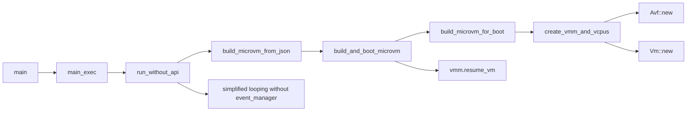

# Run Firecracker on macOS with Apple Silicon (Proof of Concept)

This document describes how to run Firecracker built from this repository on macOS with Apple Silicon.

Notes there're LOTs of codes disabled by `#[cfg(target_os = "linux")]` for a minimal workable version.

## Current status

- Successfully creating a microvm using the `macos.json` configuration file.
- Run `openssl speed` within the microvm and confirm Apple Virtualization Framework (AVF) works by its native performance.

## Current Environment

Host and Build environment:

- macOS 15.1.1 (`arm64`)
- MacBook Air M2 with 8GB RAM

Guest (microvm):

- Ubuntu 24.04 LTS (`aarch64`)
- kernel-6.1.102

## Prerequisites

A Linux kernel ARM64 boot executable Image (uncompressed, no ELF header), e.g.,

```bash
% file kernel-6.1.102
kernel-6.1.102: Linux kernel ARM64 boot executable Image, little-endian, 4K pages
```

And a rootfs, e.g.,

```bash
% file ubuntu-24.04.ext4
ubuntu-24.04.ext4: Linux rev 1.0 ext4 filesystem data, UUID=ab5aa18e-746a-4325-9ad0-a7ccb5dda20e (extents) (64bit) (large files) (huge files)
```

### Prepare the running directory

Modify the running directory path if needed:

```bash
FIRECRACKER_RUN_DIR="../firecracker_run"
mkdir -p $FIRECRACKER_RUN_DIR
```

### Prepare the Image (docker required)

Note even the `vmlinux` used in Firecracker KVM flow has the desired format:

```bash
% ARCH="aarch64"
% latest=$(
  wget "http://spec.ccfc.min.s3.amazonaws.com/?prefix=firecracker-ci/v1.11/$ARCH/vmlinux-6.1&list-type=2" \
    -O - 2>/dev/null \
  | sed -nE 's#.*<Key>(firecracker-ci/v1\.11/'"$ARCH"'/vmlinux-6\.1\.[0-9]+)</Key>.*#\1#p' \
  | tail -1
)
% wget "https://s3.amazonaws.com/spec.ccfc.min/${latest}"

% file vmlinux-6.1.102
vmlinux-6.1.102: Linux kernel ARM64 boot executable Image, little-endian, 4K pages
```

It CANNOT be used directly. Running on it will result in a stuck.

Guess the kernel `.config` is tuned for `virtio-mmio, pci=off, console=ttyS0`,
but Apple’s Virtualization Framework (AVF) only provides `virtio-pci` devices (block, net, console, etc.) rather than virtio-mmio.
Thus we need a kernel configured for `virtio-pci` so the guest sees the block device and console that AVF is providing.

Leverage the virt-fwk repository:

```bash
git clone https://github.com/drink7036290/virt-fwk
cd virt-fwk
```

Build the Image, current version is `kernel-6.1.102` (make `-j1` internally to avoid out-of-memory error):

```bash
make build-kernel
```

Move the kernel image to the running directory:

```bash
mv assets/kernel-6.1.102 $FIRECRACKER_RUN_DIR
```

### Prepare the rootfs

Similar as the `getting-started.md` with some tweaks for macOS.

```bash
# Download a rootfs
ARCH="aarch64"
brew install wget
wget -O ubuntu-24.04.squashfs.upstream "https://s3.amazonaws.com/spec.ccfc.min/firecracker-ci/v1.11/${ARCH}/ubuntu-24.04.squashfs"

# Decompress the rootfs
sudo rm -fr squashfs-root/
brew install squashfs
unsquashfs ubuntu-24.04.squashfs.upstream

# Create an ssh key for the rootfs
rm -f ubuntu-24.04.id_rsa
ssh-keygen -f id_rsa -N ""
cp -v id_rsa.pub squashfs-root/root/.ssh/authorized_keys
mv -v id_rsa ./ubuntu-24.04.id_rsa

# Create ext4 filesystem image
sudo rm -fr ubuntu-24.04.ext4
sudo chown -R root:wheel squashfs-root
truncate -s 400M ubuntu-24.04.ext4
brew install e2fsprogs
sudo /opt/homebrew/opt/e2fsprogs/sbin/mke2fs -d squashfs-root -t ext4 ubuntu-24.04.ext4
mv ubuntu-24.04.ext4 $FIRECRACKER_RUN_DIR
```

## Build and Run Firecracker on macOS

1. Modify the JSON configuration file `macos.json` if needed, then copy it and the entitlements file which is required by macOS into the running directory.

    ```bash
    cp macos.json firecracker.entitlements $FIRECRACKER_RUN_DIR
    ```

2. Build the Firecracker binary and copy it to the running directory.

    ```bash
    BUILD_TARGET="aarch64-apple-darwin"

    cargo build --target $BUILD_TARGET --bin firecracker
    cp build/cargo_target/$BUILD_TARGET/debug/firecracker $FIRECRACKER_RUN_DIR
    ```

3. Go to the running directory and sign the Firecracker binary with the entitlements file.

    ```bash
    cd $FIRECRACKER_RUN_DIR
    codesign -f --entitlement ./firecracker.entitlements -s - ./firecracker
    ```

4. Run the Firecracker binary with the JSON configuration file as no-api (server-only) mode. The dtruss is just for debugging.

    ```bash
    sudo dtruss -f ./firecracker --no-api --config-file macos.json
    ```

5. Within the microvm, login with root:

    ```bash
    Ubuntu 24.04.1 LTS ubuntu-fc-uvm hvc0

    ubuntu-fc-uvm login: root
    ```

6. Setup internet access in the guest:

    ```bash
    ip addr add 192.168.64.10/24 dev enp0s1
    ip link set enp0s1 up
    ip route add default via 192.168.64.1
    echo "nameserver 8.8.8.8" > /etc/resolv.conf
    ```

7. Download the openssl:

    ```bash
    apt update
    apt install openssl
    ```

8. Run `openssl speed` to measure the performance.

    ```bash
    openssl speed
    ```

## Running results

```bash
% sudo dtruss -f ./firecracker --no-api --config-file macos.json
Password:
dtrace: system integrity protection is on, some features will not be available

        PID/THRD  SYSCALL(args)                  = return
2025-01-29T11:56:36.241710000 [anonymous-instance:main] Running Firecracker v1.11.0-dev
can_start: true
Starting VM...
2025-01-29T11:56:36.364820000 [anonymous-instance:main] Successfully started microvm that was configured from one single json
Waiting for VM state changes...
[    0.064421] cacheinfo: Unable to detect cache hierarchy for CPU 0
[    0.065049] loop: module loaded
[    0.065168] virtio_blk virtio2: 1/0/0 default/read/poll queues
[    0.065354] virtio_blk virtio2: [vda] 819200 512-byte logical blocks (419 MB/400 MiB)
[    0.067046] megasas: 07.719.03.00-rc1
[    0.067485] tun: Universal TUN/TAP device driver, 1.6
[    0.067910] thunder_xcv, ver 1.0
[    0.067952] thunder_bgx, ver 1.0
[    0.067976] nicpf, ver 1.0
[    0.068074] hns3: Hisilicon Ethernet Network Driver for Hip08 Family - version
[    0.068114] hns3: Copyright (c) 2017 Huawei Corporation.
[    0.068153] hclge is initializing
[    0.068182] e1000: Intel(R) PRO/1000 Network Driver
[    0.068212] e1000: Copyright (c) 1999-2006 Intel Corporation.
[    0.068249] e1000e: Intel(R) PRO/1000 Network Driver
[    0.068277] e1000e: Copyright(c) 1999 - 2015 Intel Corporation.
[    0.068322] igb: Intel(R) Gigabit Ethernet Network Driver
[    0.068348] igb: Copyright (c) 2007-2014 Intel Corporation.
[    0.068384] igbvf: Intel(R) Gigabit Virtual Function Network Driver
[    0.068417] igbvf: Copyright (c) 2009 - 2012 Intel Corporation.
[    0.068466] sky2: driver version 1.30
[    0.068560] VFIO - User Level meta-driver version: 0.3
[    0.068853] usbcore: registered new interface driver usb-storage
[    0.069173] rtc-pl031 20050000.pl031: registered as rtc0
[    0.069251] rtc-pl031 20050000.pl031: setting system clock to 2025-01-29T03:56:36 UTC (1738122996)
[    0.069362] i2c_dev: i2c /dev entries driver
[    0.069915] sdhci: Secure Digital Host Controller Interface driver
[    0.069996] sdhci: Copyright(c) Pierre Ossman
[    0.070079] Synopsys Designware Multimedia Card Interface Driver
[    0.070189] sdhci-pltfm: SDHCI platform and OF driver helper
[    0.070347] ledtrig-cpu: registered to indicate activity on CPUs
[    0.070540] usbcore: registered new interface driver usbhid
[    0.070579] usbhid: USB HID core driver
[    0.071031] NET: Registered PF_PACKET protocol family
[    0.071089] 9pnet: Installing 9P2000 support
[    0.071157] Key type dns_resolver registered
[    0.071226] registered taskstats version 1
[    0.071264] Loading compiled-in X.509 certificates
[    0.072443] input: gpio-keys as /devices/platform/gpio-keys/input/input0
[    0.072603] clk: Disabling unused clocks
[    0.072634] ALSA device list:
[    0.072664]   No soundcards found.
[    0.125442] EXT4-fs (vda): 5 orphan inodes deleted
[    0.125470] EXT4-fs (vda): recovery complete
[    0.140515] EXT4-fs (vda): mounted filesystem with ordered data mode. Quota mode: none.
[    0.140562] VFS: Mounted root (ext4 filesystem) on device 254:0.
[    0.140742] devtmpfs: mounted
[    0.141118] Freeing unused kernel memory: 7552K
[    0.141165] Run /sbin/init as init process
[    0.185005] systemd[1]: systemd 255.4-1ubuntu8.4 running in system mode (+PAM +AUDIT +SELINUX +APPARMOR +IMA +SMACK +SECCOMP +GCRYPT -GNUTLS +OPENSSL +ACL +BLKID +CURL +ELFUTILS +FIDO2 +IDN2 -IDN +IPTC +KMOD +LIBCRYPTSETUP +LIBFDISK +PCRE2 -PWQUALITY +P11KIT +QRENCODE +TPM2 +BZIP2 +LZ4 +XZ +ZLIB +ZSTD -BPF_FRAMEWORK -XKBCOMMON +UTMP +SYSVINIT default-hierarchy=unified)
[    0.185104] systemd[1]: Detected virtualization vm-other.
[    0.185126] systemd[1]: Detected architecture arm64.

Welcome to Ubuntu 24.04.1 LTS!

[    0.185825] systemd[1]: Hostname set to <ubuntu-fc-uvm>.
[    0.247547] systemd[1]: Queued start job for default target graphical.target.
[    0.253785] systemd[1]: Created slice system-getty.slice - Slice /system/getty.
[  OK  ] Created slice system-getty.slice - Slice /system/getty.
[    0.254096] systemd[1]: Created slice system-modprobe.slice - Slice /system/modprobe.
[  OK  ] Created slice system-modprobe.slice - Slice /system/modprobe.
[    0.254292] systemd[1]: Created slice system-serial\x2dgetty.slice - Slice /system/serial-getty.
[  OK  ] Created slice system-serial\x2dget…slice - Slice /system/serial-getty.
[    0.254456] systemd[1]: Created slice user.slice - User and Session Slice.
[  OK  ] Created slice user.slice - User and Session Slice.
[    0.254561] systemd[1]: Started systemd-ask-password-console.path - Dispatch Password Requests to Console Directory Watch.
[  OK  ] Started systemd-ask-password-conso…equests to Console Directory Watch.
[    0.254672] systemd[1]: Started systemd-ask-password-wall.path - Forward Password Requests to Wall Directory Watch.
[  OK  ] Started systemd-ask-password-wall.…d Requests to Wall Directory Watch.
[    0.254772] systemd[1]: proc-sys-fs-binfmt_misc.automount - Arbitrary Executable File Formats File System Automount Point was skipped because of an unmet condition check (ConditionPathExists=/proc/sys/fs/binfmt_misc).
[    0.254872] systemd[1]: Expecting device dev-hvc0.device - /dev/hvc0...
         Expecting device dev-hvc0.device - /dev/hvc0...
[    0.254948] systemd[1]: Reached target cryptsetup.target - Local Encrypted Volumes.
[  OK  ] Reached target cryptsetup.target - Local Encrypted Volumes.
[    0.255016] systemd[1]: Reached target integritysetup.target - Local Integrity Protected Volumes.
[  OK  ] Reached target integritysetup.targ… Local Integrity Protected Volumes.
[    0.255092] systemd[1]: Reached target paths.target - Path Units.
[  OK  ] Reached target paths.target - Path Units.
[    0.255144] systemd[1]: Reached target remote-fs.target - Remote File Systems.
[  OK  ] Reached target remote-fs.target - Remote File Systems.
[    0.255198] systemd[1]: Reached target slices.target - Slice Units.
[  OK  ] Reached target slices.target - Slice Units.
[    0.255255] systemd[1]: Reached target swap.target - Swaps.
[  OK  ] Reached target swap.target - Swaps.
[    0.255303] systemd[1]: Reached target veritysetup.target - Local Verity Protected Volumes.
[  OK  ] Reached target veritysetup.target - Local Verity Protected Volumes.
[    0.255382] systemd[1]: Listening on systemd-initctl.socket - initctl Compatibility Named Pipe.
[  OK  ] Listening on systemd-initctl.socke…- initctl Compatibility Named Pipe.
[    0.255483] systemd[1]: Listening on systemd-journald-dev-log.socket - Journal Socket (/dev/log).
[  OK  ] Listening on systemd-journald-dev-…socket - Journal Socket (/dev/log).
[    0.255578] systemd[1]: Listening on systemd-journald.socket - Journal Socket.
[  OK  ] Listening on systemd-journald.socket - Journal Socket.
[    0.255638] systemd[1]: systemd-pcrextend.socket - TPM2 PCR Extension (Varlink) was skipped because of an unmet condition check (ConditionSecurity=measured-uki).
[    0.256665] systemd[1]: Listening on systemd-udevd-control.socket - udev Control Socket.
[  OK  ] Listening on systemd-udevd-control.socket - udev Control Socket.
[    0.256758] systemd[1]: Listening on systemd-udevd-kernel.socket - udev Kernel Socket.
[  OK  ] Listening on systemd-udevd-kernel.socket - udev Kernel Socket.
[    0.257257] systemd[1]: Mounting dev-hugepages.mount - Huge Pages File System...
         Mounting dev-hugepages.mount - Huge Pages File System...
[    0.257496] systemd[1]: Mounting dev-mqueue.mount - POSIX Message Queue File System...
         Mounting dev-mqueue.mount - POSIX Message Queue File System...
[    0.260959] systemd[1]: Mounting sys-kernel-debug.mount - Kernel Debug File System...
         Mounting sys-kernel-debug.mount - Kernel Debug File System...
[    0.261056] systemd[1]: sys-kernel-tracing.mount - Kernel Trace File System was skipped because of an unmet condition check (ConditionPathExists=/sys/kernel/tracing).
[    0.264454] systemd[1]: Mounting tmp.mount - Temporary Directory /tmp...
         Mounting tmp.mount - Temporary Directory /tmp...
[    0.266485] systemd[1]: Mounting var-lib-systemd.mount - /var/lib/systemd...
         Mounting var-lib-systemd.mount - /var/lib/systemd...
[    0.268698] systemd[1]: Starting systemd-journald.service - Journal Service...
         Starting systemd-journald.service - Journal Service...
[    0.268792] systemd[1]: kmod-static-nodes.service - Create List of Static Device Nodes was skipped because of an unmet condition check (ConditionFileNotEmpty=/lib/modules/6.1.102/modules.devname).
[    0.274034] systemd[1]: Starting modprobe@configfs.service - Load Kernel Module configfs...
         Starting modprobe@configfs.service - Load Kernel Module configfs...
[    0.277494] systemd[1]: Starting modprobe@dm_mod.service - Load Kernel Module dm_mod...
         Starting modprobe@dm_mod.service - Load Kernel Module dm_mod...
[    0.279266] systemd[1]: Starting modprobe@drm.service - Load Kernel Module drm...
         Starting modprobe@drm.service - Load Kernel Module drm...
[    0.280038] systemd-journald[113]: Collecting audit messages is disabled.
[    0.285375] systemd[1]: Starting modprobe@efi_pstore.service - Load Kernel Module efi_pstore...
         Starting modprobe@efi_pstore.servi… - Load Kernel Module efi_pstore...
[    0.287484] systemd[1]: Starting modprobe@fuse.service - Load Kernel Module fuse...
         Starting modprobe@fuse.service - Load Kernel Module fuse...
[    0.289459] systemd[1]: Starting modprobe@loop.service - Load Kernel Module loop...
         Starting modprobe@loop.service - Load Kernel Module loop...
[    0.291536] systemd[1]: Starting systemd-modules-load.service - Load Kernel Modules...
         Starting systemd-modules-load.service - Load Kernel Modules...
[    0.291642] systemd[1]: systemd-pcrmachine.service - TPM2 PCR Machine ID Measurement was skipped because of an unmet condition check (ConditionSecurity=measured-uki).
[    0.293560] systemd[1]: Starting systemd-remount-fs.service - Remount Root and Kernel File Systems...
         Starting systemd-remount-fs.servic…unt Root and Kernel File Systems...
[    0.296595] systemd[1]: Starting systemd-tmpfiles-setup-dev-early.service - Create Static Device Nodes in /dev gracefully...
         Starting systemd-tmpfiles-setup-de… Device Nodes in /dev gracefully...
[    0.296719] systemd[1]: systemd-tpm2-setup-early.service - TPM2 SRK Setup (Early) was skipped because of an unmet condition check (ConditionSecurity=measured-uki).
[    0.299280] systemd[1]: Starting systemd-udev-trigger.service - Coldplug All udev Devices...
         Starting systemd-udev-trigger.service - Coldplug All udev Devices...
[    0.299893] systemd[1]: Started systemd-journald.service - Journal Service.
[  OK  ] Started systemd-journald.service - Journal Service.
[  OK  ] Mounted dev-hugepages.mount - Huge Pages File System.
[  OK  ] Mounted dev-mqueue.mount - POSIX Message Queue File System.
[  OK  ] Mounted sys-kernel-debug.mount - Kernel Debug File System.
[  OK  ] Mounted tmp.mount - Temporary Directory /tmp.
[  OK  ] Mounted var-lib-systemd.mount - /var/lib/systemd.
[  OK  ] Finished modprobe@configfs.service - Load Kernel Module configfs.
[  OK  ] Finished modprobe@dm_mod.service - Load Kernel Module dm_mod.
[  OK  ] Finished modprobe@drm.service - Load Kernel Module drm.
[  OK  ] Finished modprobe@efi_pstore.service - Load Kernel Module efi_pstore.
[  OK  ] Finished modprobe@fuse.service - Load Kernel Module fuse.
[  OK  ] Finished modprobe@loop.service - Load Kernel Module loop.
[  OK  ] Finished systemd-modules-load.service - Load Kernel Modules.
[  OK  ] Finished systemd-remount-fs.servic…mount Root and Kernel File Systems.
         Mounting sys-kernel-config.mount - Kernel Configuration File System...
         Starting systemd-journal-flush.ser…sh Journal to Persistent Storage...
         Starting systemd-random-seed.service - Load/Save OS Random Seed...
[    0.318577] systemd-journald[113]: Received client request to flush runtime journal.
         Starting systemd-sysctl.service - Apply Kernel Variables...
[  OK  ] Finished systemd-tmpfiles-setup-de…ic Device Nodes in /dev gracefully.
[  OK  ] Mounted sys-kernel-config.mount - Kernel Configuration File System.
[  OK  ] Finished systemd-journal-flush.ser…lush Journal to Persistent Storage.
         Starting systemd-tmpfiles-setup-de…eate Static Device Nodes in /dev...
[  OK  ] Finished systemd-tmpfiles-setup-de…Create Static Device Nodes in /dev.
[  OK  ] Reached target local-fs-pre.target…Preparation for Local File Systems.
[  OK  ] Reached target local-fs.target - Local File Systems.
[  OK  ] Listening on systemd-sysext.socket…tension Image Management (Varlink).
         Starting systemd-tmpfiles-setup.se…e Volatile Files and Directories...
         Starting systemd-udevd.service - R…ager for Device Events and Files...
[  OK  ] Finished systemd-sysctl.service - Apply Kernel Variables.
[  OK  ] Finished systemd-tmpfiles-setup.se…ate Volatile Files and Directories.
         Starting systemd-update-utmp.servi…ord System Boot/Shutdown in UTMP...
[  OK  ] Finished systemd-update-utmp.servi…ecord System Boot/Shutdown in UTMP.
[  OK  ] Started systemd-udevd.service - Ru…anager for Device Events and Files.
[  OK  ] Finished systemd-udev-trigger.service - Coldplug All udev Devices.
[  OK  ] Reached target sysinit.target - System Initialization.
[  OK  ] Started systemd-tmpfiles-clean.tim…y Cleanup of Temporary Directories.
[  OK  ] Reached target timers.target - Timer Units.
[  OK  ] Listening on ssh.socket - OpenBSD Secure Shell server socket.
[  OK  ] Reached target sockets.target - Socket Units.
[  OK  ] Reached target basic.target - Basic System.
         Starting fcnet.service...
         Starting getty-static.service - ge…bus and logind are not available...
         Starting systemd-user-sessions.service - Permit User Sessions...
[  OK  ] Found device dev-hvc0.device - /dev/hvc0.
[  OK  ] Finished fcnet.service.
[  OK  ] Finished systemd-user-sessions.service - Permit User Sessions.
[  OK  ] Finished getty-static.service - ge… dbus and logind are not available.
[  OK  ] Started getty@tty1.service - Getty on tty1.
[  OK  ] Started getty@tty2.service - Getty on tty2.
[  OK  ] Started getty@tty3.service - Getty on tty3.
[  OK  ] Started getty@tty4.service - Getty on tty4.
[  OK  ] Started getty@tty5.service - Getty on tty5.
[  OK  ] Started getty@tty6.service - Getty on tty6.
[  OK  ] Started serial-getty@hvc0.service - Serial Getty on hvc0.
[  OK  ] Reached target getty.target - Login Prompts.
[  OK  ] Reached target multi-user.target - Multi-User System.
[  OK  ] Reached target graphical.target - Graphical Interface.
         Starting systemd-update-utmp-runle…- Record Runlevel Change in UTMP...
[  OK  ] Finished systemd-update-utmp-runle…e - Record Runlevel Change in UTMP.
[  OK  ] Finished systemd-random-seed.service - Load/Save OS Random Seed.

Ubuntu 24.04.1 LTS ubuntu-fc-uvm hvc0

ubuntu-fc-uvm login: root
Welcome to Ubuntu 24.04.1 LTS (GNU/Linux 6.1.102 aarch64)

 * Documentation:  https://help.ubuntu.com
 * Management:     https://landscape.canonical.com
 * Support:        https://ubuntu.com/pro

This system has been minimized by removing packages and content that are
not required on a system that users do not log into.

To restore this content, you can run the 'unminimize' command.
root@ubuntu-fc-uvm:~# ip a
1: lo: <LOOPBACK,UP,LOWER_UP> mtu 65536 qdisc noqueue state UNKNOWN group default qlen 1000
    link/loopback 00:00:00:00:00:00 brd 00:00:00:00:00:00
    inet 127.0.0.1/8 scope host lo
       valid_lft forever preferred_lft forever
2: eth0: <BROADCAST,MULTICAST,UP,LOWER_UP> mtu 1500 qdisc pfifo_fast state UP group default qlen 1000
    link/ether 96:82:43:ff:7c:76 brd ff:ff:ff:ff:ff:ff
    altname enp0s1
root@ubuntu-fc-uvm:~# ip addr add 192.168.64.10/24 dev enp0s1
root@ubuntu-fc-uvm:~# ip link set enp0s1 up
root@ubuntu-fc-uvm:~# ip route add default via 192.168.64.1
root@ubuntu-fc-uvm:~# echo "nameserver 8.8.8.8" > /etc/resolv.conf
root@ubuntu-fc-uvm:~# apt update
Get:1 http://ports.ubuntu.com/ubuntu-ports noble InRelease [256 kB]
Get:2 http://ports.ubuntu.com/ubuntu-ports noble-updates InRelease [126 kB]
Get:3 http://ports.ubuntu.com/ubuntu-ports noble-backports InRelease [126 kB]
Get:4 http://ports.ubuntu.com/ubuntu-ports noble-security InRelease [126 kB]
Get:5 http://ports.ubuntu.com/ubuntu-ports noble/restricted arm64 Packages [113 kB]
Get:6 http://ports.ubuntu.com/ubuntu-ports noble/main arm64 Packages [1776 kB]
Get:7 http://ports.ubuntu.com/ubuntu-ports noble/universe arm64 Packages [19.0 MB]
Get:8 http://ports.ubuntu.com/ubuntu-ports noble/multiverse arm64 Packages [274 kB]
Get:9 http://ports.ubuntu.com/ubuntu-ports noble-updates/universe arm64 Packages [1254 kB]
Get:10 http://ports.ubuntu.com/ubuntu-ports noble-updates/main arm64 Packages [1032 kB]
Get:11 http://ports.ubuntu.com/ubuntu-ports noble-updates/multiverse arm64 Packages [15.1 kB]
Get:12 http://ports.ubuntu.com/ubuntu-ports noble-updates/restricted arm64 Packages [841 kB]
Get:13 http://ports.ubuntu.com/ubuntu-ports noble-backports/universe arm64 Packages [15.1 kB]
Get:14 http://ports.ubuntu.com/ubuntu-ports noble-security/multiverse arm64 Packages [13.6 kB]
Get:15 http://ports.ubuntu.com/ubuntu-ports noble-security/restricted arm64 Packages [821 kB]
Get:16 http://ports.ubuntu.com/ubuntu-ports noble-security/main arm64 Packages [745 kB]
Get:17 http://ports.ubuntu.com/ubuntu-ports noble-security/universe arm64 Packages [1004 kB]
Fetched 27.6 MB in 12s (2365 kB/s)
Reading package lists... Done
Building dependency tree... Done
All packages are up to date.
root@ubuntu-fc-uvm:~# apt install openssl
Reading package lists... Done
Building dependency tree... Done
Progress: [ 97%] [########################################################..]
  gcc-14-base libc6 libgcc-s1 libidn2-0 libssl3t64 libunistring5
Suggested packages:
  glibc-doc debconf | debconf-2.0 locales libnss-nis libnss-nisplus
  ca-certificates
The following NEW packages will be installed:
  gcc-14-base libc6 libgcc-s1 libidn2-0 libssl3t64 libunistring5 openssl
0 upgraded, 7 newly installed, 0 to remove and 0 not upgraded.
Need to get 6267 kB of archives.
After this operation, 34.4 MB of additional disk space will be used.
Do you want to continue? [Y/n] Y
Get:1 http://ports.ubuntu.com/ubuntu-ports noble-updates/main arm64 gcc-14-base arm64 14.2.0-4ubuntu2~24.04 [50.8 kB]
Get:2 http://ports.ubuntu.com/ubuntu-ports noble-updates/main arm64 libgcc-s1 arm64 14.2.0-4ubuntu2~24.04 [61.9 kB]
Get:3 http://ports.ubuntu.com/ubuntu-ports noble-updates/main arm64 libc6 arm64 2.39-0ubuntu8.3 [2776 kB]
Get:4 http://ports.ubuntu.com/ubuntu-ports noble-updates/main arm64 libssl3t64 arm64 3.0.13-0ubuntu3.4 [1796 kB]
Get:5 http://ports.ubuntu.com/ubuntu-ports noble-updates/main arm64 libunistring5 arm64 1.1-2build1.1 [530 kB]
Get:6 http://ports.ubuntu.com/ubuntu-ports noble-updates/main arm64 libidn2-0 arm64 2.3.7-2build1.1 [67.2 kB]
Get:7 http://ports.ubuntu.com/ubuntu-ports noble-updates/main arm64 openssl arm64 3.0.13-0ubuntu3.4 [985 kB]
Fetched 6267 kB in 4s (1597 kB/s)
debconf: delaying package configuration, since apt-utils is not installed
root@ubuntu-fc-uvm:~# openssl speed
Doing md5 for 3s on 16 size blocks: 18024097 md5's in 3.00s
Doing md5 for 3s on 64 size blocks: 10904394 md5's in 3.00s
Doing md5 for 3s on 256 size blocks: 4944625 md5's in 2.99s
Doing md5 for 3s on 1024 size blocks:
Vmm is stopping.

Stopping VM...
marshalllee@MarshalldeMacBook-Air firecracker_run %
```

## Component Relationship Diagram


## Current minimal working flow



## To Do

- initramfs path
- memory balloon
- network device
- entropy device
- ...other capabilities that AVF provides

- client-server API, not just server-only
- replace `epoll/eventfd` from event-manager with something like `kqueue + kevent`

- upgrade virt-fwk's objc2 version from 0.3.x to 0.5.2, which includes lots of API changes

- encapsulate the common behavior of KVM and AVF into a common trait, and move it from Firecracker into rust-vmm, so other high level VMMs like `Cloud Hypervisor` or `libkrun` can use it
- move rust-bindings from virt-fwk into rust-vmm

- ...etc.
